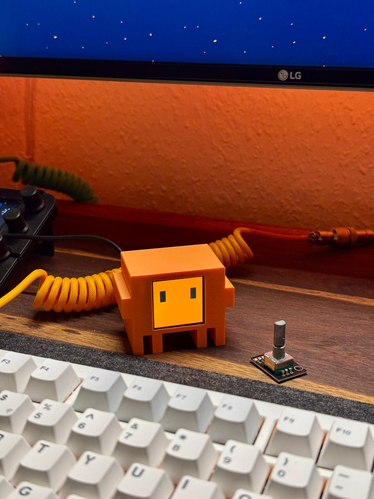
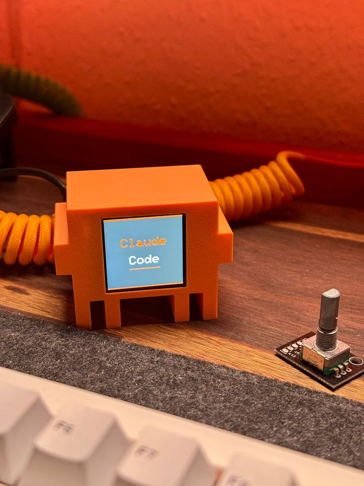

<!-- LOGO -->
<p align="center">
  
</p>

# Clawd Mochi 🦀🤖

A physical desk companion inspired by **Clawd** — the pixel-crab mascot of Claude Code by Anthropic. An ESP32-C3 drives a 1.54" color TFT display and hosts a mobile web controller — no app required.

> 📝 **二次开发版本** — 本项目基于原版 Clawd Mochi 进行了功能扩展，新增了系统监控、定时提醒、表情系统等功能。

**Cost: ~$6–8 · Build time: ~1 hour · Skill level: Beginner**

📦 3D printable case on MakerWorld: [https://makerworld.com/en/models/2559505-clawd-mochi-physical-claude-code-mascot#profileId-2820000](https://makerworld.com/en/models/2559505-clawd-mochi-physical-claude-code-mascot#profileId-2820000)

---

> ⚠️ This is an independent fan project. It is not affiliated with, sponsored by, or endorsed by Anthropic. "Claude" and "Clawd" are trademarks of Anthropic.

---

<p align="center">
  
  &nbsp;
  
</p>

## What it does

Clawd Mochi sits on your desk and shows animated expressions on a small color display. Connect via WiFi to control it from any browser:

### Core Features (原版功能)

- **Normal eyes** — 像素方块眼睛，带摆动和眨眼动画
- **Squish eyes** — 弧形眯眯眼 `> <`，开心挤眼动画
- **Claude Code** — 显示 "Claude Code" 终端界面
- **Canvas** — 手机实时绘画，画布模式
- **Backlight control** — 屏幕背光开关

### Extended Features (新增功能)

- **Monitor PC** — 系统监控面板，从PC获取负载、内存、温度、运行时间
- **Reminder** — 定时提醒系统，最多5条提醒，自定义时间和消息
- **Static Faces** — 7种静态表情（无语、问号、感叹号、生气、对号、叉叉、墨镜）
- **Animated Faces** — 10种动画表情（挤眼睛、晕晕、闭眼睛、死掉了、等等、笑笑、看你、心跳、睡着了、尴尬）
- **WiFi Provisioning** — AP配网模式，首次启动自动创建热点供用户配置
- **Settings Page** — Web设置页面，可修改PC监控IP或重置WiFi配置

---

## Parts list

| Part                | Spec                             | ~Price |
| ------------------- | -------------------------------- | ------ |
| ESP32-C3 Super Mini | microcontroller with WiFi        | ~$2.50 |
| ST7789 1.54" TFT    | 240×240 SPI color display        | ~$3.00 |
| 8 short wires       | 8–10 cm Dupont / jumper wires    | ~$0.50 |
| 2× M2×6mm screws    | to mount display bezel           | ~$0.10 |
| Double-sided tape   | to secure components inside case | ~$0.10 |
| USB-C cable         | for power                        | —      |
| 3D printed case     | PLA or PETG, ~30g                | ~$0.50 |

**Total: ~$7–8**

---

## Wiring

> ⚠️ Connect VCC to **3.3V only** — never 5V. Use GPIO 8 and 10 for SPI (hardware SPI, fast). Do not use GPIO 6/7 for SPI.

| Display pin | ESP32-C3 GPIO  | Wire color (suggested) |
| ----------- | -------------- | ---------------------- |
| VCC         | 3V3            | Red                    |
| GND         | GND            | Black                  |
| SDA         | GPIO 10 (MOSI) | Orange                 |
| SCL         | GPIO 8 (SCK)   | Green                  |
| RES         | GPIO 2         | Purple                 |
| DC          | GPIO 1         | Blue                   |
| CS          | GPIO 4         | White                  |
| BL          | GPIO 3         | Yellow                 |

---

## Software setup

### Step 1 — Install Arduino IDE

Download [Arduino IDE 2.x](https://www.arduino.cc/en/software) and install it.

### Step 2 — Add ESP32 board support

1. Open Arduino IDE → **File → Preferences**
2. In "Additional boards manager URLs" paste:
   ```
   https://raw.githubusercontent.com/espressif/arduino-esp32/gh-pages/package_esp32_index.json
   ```
3. Go to **Tools → Board → Boards Manager**, search `esp32`, install **"esp32 by Espressif Systems"**

### Step 3 — Install libraries

Go to **Tools → Library Manager** and install:

- `Adafruit GFX Library`
- `Adafruit ST7735 and ST7789 Library`
- `ArduinoJson` (用于解析 stats.json)

### Step 4 — Configure board settings

Go to **Tools** and set:

| Setting         | Value                   |
| --------------- | ----------------------- |
| Board           | ESP32C3 Dev Module      |
| USB CDC On Boot | **Enabled** ← important |
| CPU Frequency   | 160 MHz                 |
| Upload Speed    | 921600                  |

### Step 5 — Upload the sketch

1. Clone or download this repo
2. Open `clawd_mochi/clawd_mochi.ino` in Arduino IDE
3. Connect the ESP32 via USB-C
4. Select the correct port under **Tools → Port**
5. Click **Upload** (→ arrow button)
6. Wait for "Hard resetting via RTS pin..." — this means success

---

## WiFi Configuration (WiFi 配网)

本公版采用 **AP配网模式**，首次启动时自动创建热点供用户配置WiFi：

### 配网流程

1. 首次启动或重置后，设备进入AP模式
2. 使用手机/电脑连接WiFi热点：**`Clawd-Mochi-Setup`**（无密码）
3. 打开浏览器访问：**`http://192.168.4.1`**
4. 在配网页面选择/输入WiFi名称、密码、PC监控IP地址
5. 点击"Save & Restart"，设备保存配置并重启
6. 重启后自动连接用户WiFi，进入正常运行模式

### 重置配网

如需更换WiFi网络，可通过以下方式重置：

**方式一：Web界面重置**
1. 连接设备WiFi，打开Web控制器
2. 点击"⚙ settings"按钮进入设置页面
3. 点击红色的"Reset WiFi Config"按钮
4. 确认后设备清除配置并重启，进入配网模式

**方式二：GPIO重置（开发者功能）**
- 启动时将 **GPIO 5** 拉低（接地），可清除WiFi配置重新配网

---

## How to use it

### Connect and open the controller

1. Power the ESP32 via USB-C (any USB charger or power bank)
2. Wait for boot animation and WiFi connection (screen shows connected status)
3. Open a browser and go to the IP address shown on screen

You should see the web controller:


### Controller features (控制器功能)

| 控件             | 功能说明                              |
| ---------------- | ------------------------------------- |
| Normal eyes      | 摆动+眨眼动画                          |
| Claude Code      | 终端显示，可输入文字                   |
| Canvas           | 画布模式，手机实时绘画                 |
| Monitor          | 系统监控面板（负载/内存/温度/运行时间）|
| Speed slider     | 动画速度（慢/正常/快）                 |
| Background color | 背景色设置（默认橙色）                 |
| Pen color        | 画布画笔颜色                           |
| Display on/off   | 屏幕背光开关                           |
| Static Face      | 静态表情下拉菜单（7种）                |
| Animated Face    | 动画表情下拉菜单（10种）               |

### Reminder System (提醒系统)

Web 界面底部有提醒管理区域：

| 操作        | 说明                     |
| ----------- | ------------------------ |
| Add Reminder | 添加新提醒（时间+消息）  |
| Enable/Disable | 启用/禁用提醒          |
| Delete      | 删除提醒                 |

提醒触发时屏幕显示消息，30秒后自动返回原视图。

---

## PC Monitor Integration (PC监控集成)

Monitor 和 Reminder 功能需要运行PC上的监控脚本提供服务。

### 使用PC监控脚本

项目提供 `pc_monitor/` 目录下的Python脚本：

```bash
cd pc_monitor
pip install -r requirements.txt
python pc_monitor.py
```

启动后脚本运行在 `http://你的PC IP:8080`，提供系统托盘图标和开机自启功能。

详见：[`pc_monitor/README.md`](pc_monitor/README.md)

### API接口

```
http://<PC IP>:8080/stats.json
```

### 返回JSON字段

```json
{
  "load": "25.5",
  "mem": 45,
  "temp": "42°C",   // Windows下可能为null
  "uptime": "3d 5h",
  "hour": 14,
  "minute": 30,
  "day": 27
}
```

> ⚠️ **Windows温度限制**: Windows系统下CPU温度获取受限，`temp`字段可能返回`null`。如需准确温度建议使用第三方工具。

### 配置PC IP地址

- 配网时在配网页面输入PC IP
- 运行时通过Web控制器 → Settings → 修改PC IP

Monitor 面板每 50 秒自动刷新数据。

---

## Face System (表情系统)

表情通过代码绘制（使用 6×6 像素块），而非位图文件。

### Static Faces (静态表情 - 7种)

| 表情       | 命令             | 说明           |
| ---------- | ---------------- | -------------- |
| 无语       | `face_wuyu`      | -_- 表情       |
| 问号       | `face_wenhao`    | ? 疑问         |
| 感叹号     | `face_gantanhao` | ! 感叹         |
| 生气       | `face_angry`     | >< 气愤        |
| 对号       | `face_yes`       | ✓ OK          |
| 叉叉       | `face_X`         | ✗ NO          |
| 墨镜       | `face_glass`     | sunglasses 墨镜|

### Animated Faces (动画表情 - 10种)

| 表情     | 命令             | 帧序列                    | 说明 |
| -------- | ---------------- | ------------------------- | ---- |
| 挤眼睛   | `anim_jiyanjing` | jiyanjing1/jiyanjing2     | 3遍循环 |
| 晕晕     | `anim_yun`       | yun1/yun2/yun3            | 3遍循环 |
| 闭眼睛   | `anim_close`     | close1/close2/close3      | 3遍循环 |
| 死掉了   | `anim_dead`      | dead1/dead2/dead3         | 3遍循环 |
| 等等     | `anim_dian`      | dian1→dian2→dian3(停)     | 单次 |
| 笑笑     | `anim_smile`     | smile1/smile2             | 3遍循环 |
| 看你     | `anim_look`      | look1/look2               | 3遍循环 |
| 心跳     | `anim_hart`      | hart1/hart2               | 3遍循环 |
| 睡着了   | `anim_zzz`       | zzz1→zzz2→zzz3(停)        | 单次 |
| 尴尬     | `anim_ganga`     | ganga1→ganga2→ganga3(停)  | 单次 |

表情代码位于 `faces_code.h`，由工具自动生成。

---

## 3D case

The electronics case (body + back) is in the `clawd_mochi` model folder:

| File                                                                                 | Description                               |
| ------------------------------------------------------------------------------------ | ----------------------------------------- |
| [`./models/clawd_mochi/clawd_mochi_v1.stl`](./models/clawd_mochi/clawd_mochi_v1.stl) | Main case layout with body and back parts |

### Print settings

| Setting      | Value                               |
| ------------ | ----------------------------------- |
| Material     | PLA or PETG                         |
| Layer height | 0.15–0.20 mm                        |
| Infill       | 15% gyroid                          |
| Supports     | Yes — for display window overhang   |
| Orientation  | Face-down, flat back on build plate |

Suggested colors: orange PLA for body, matte black for back plate.

You can also download the models from MakerWorld: [https://makerworld.com/en/models/2559505-clawd-mochi-physical-claude-code-mascot#profileId-2820000](https://makerworld.com/en/models/2559505-clawd-mochi-physical-claude-code-mascot#profileId-2820000)

### 3D Clawd (no electronics)

If you just want a display piece, use the separate 3D Clawd model (no screen or electronics cutouts).


Model file: [`./models/clawd_3d/Clawd_3D_no_AMS.stl`](./models/clawd_3d/Clawd_3D_no_AMS.stl)

---

## Assembly tips

1. Print the case file (body + back) and test-fit the display before gluing anything
2. Thread the 8 wires through the back plate slot before soldering
3. Use double-sided tape to fix the ESP32 against the inside of the back plate
4. Secure the display with 2× M2×6mm screws through the bezel holes
5. Route the USB-C cable through the back plate slot and snap the back on

---

## Customisation

### Eye size and position

Edit these constants near the top of `clawd_mochi.ino`:

```cpp
#define EYE_W   30    // eye width in pixels
#define EYE_H   60    // eye height in pixels
#define EYE_GAP 120   // gap between eyes
#define EYE_OX  0     // horizontal offset
#define EYE_OY  40    // vertical offset upward
```

### WiFi configuration (公版)

WiFi配置通过AP配网模式完成，无需修改代码：

- 首次启动自动创建热点 `Clawd-Mochi-Setup`
- 用户通过配网页面输入WiFi SSID、密码、PC监控IP
- 配置保存到Preferences（非易失存储）

### PC Monitor IP

PC监控IP地址在配网时设置，也可通过Web设置页面修改。

### Monitor refresh interval

```cpp
const unsigned long MONITOR_INTERVAL = 50000;  // 50 seconds
```

### Reminder duration

```cpp
const unsigned long REMINDER_DURATION = 30000;  // 30 seconds
```

---

## File Structure (文件结构)

```
clawd_mochi/
├── clawd_mochi.ino    # 主程序 (~1700行)
├── faces_code.h       # 表情绘制函数 (~1100行，自动生成)
└── .theia/            # Eclipse Theia 配置
```

---

## Web API Endpoints

| Route | Method | Description |
|-------|--------|-------------|
| `/` | GET | Web controller HTML |
| `/cmd?k=xxx` | GET | Execute command |
| `/char?c=x` | GET | Add char to terminal |
| `/speed?v=1-3` | GET | Set animation speed |
| `/redraw?bg=#RRGGBB` | GET | Set background and redraw |
| `/backlight?on=1/0` | GET | Toggle backlight |
| `/canvas?on=1/0` | GET | Toggle canvas mode |
| `/draw/clear?bg=#RRGGBB` | GET | Clear canvas |
| `/draw/stroke?pen=#RRGGBB&pts=x,y;x,y` | GET | Draw stroke |
| `/state` | GET | Get current state JSON |
| `/reminder` | GET/POST/PUT/DELETE | CRUD for reminders |

---

## Contributing

Contributions are very welcome! Here are some ideas:

- **新动画** — 添加更多表情、过渡效果
- **天气显示** — 接入天气API
- **声音** — 添加蜂鸣器音效
- **传感器** — 触摸/按钮交互
- **OTA更新** — 固件远程升级
- **智能家居** — MQTT/Home Assistant 集成

To contribute: fork the repo, make your changes, and open a pull request. 请保持单文件结构 (`clawd_mochi.ino`) 以便于新手使用。

## License

本项目采用双协议许可方式：

### 代码许可 (MIT License)

源代码（包括但不限于 `clawd_mochi.ino`、`faces_code.h`、`pc_monitor.py` 等）采用 **MIT License** 许可。

```
MIT License

Copyright (c) 2026 Yousuf Amanuel

Permission is hereby granted, free of charge, to any person obtaining a copy
of this software and associated documentation files (the "Software"), to deal
in the Software without restriction, including without limitation the rights
to use, copy, modify, merge, publish, distribute, sublicense, and/or sell
copies of the Software, and to permit persons to whom the Software is
furnished to do so, subject to the following conditions:

The above copyright notice and this permission notice shall be included in all
copies or substantial portions of the Software.

THE SOFTWARE IS PROVIDED "AS IS", WITHOUT WARRANTY OF ANY KIND, EXPRESS OR
IMPLIED, INCLUDING BUT NOT LIMITED TO THE WARRANTIES OF MERCHANTABILITY,
FITNESS FOR A PARTICULAR PURPOSE AND NONINFRINGEMENT. IN NO EVENT SHALL THE
AUTHORS OR COPYRIGHT HOLDERS BE LIABLE FOR ANY CLAIM, DAMAGES OR OTHER
LIABILITY, WHETHER IN AN ACTION OF CONTRACT, TORT OR OTHERWISE, ARISING FROM,
OUT OF OR IN CONNECTION WITH THE SOFTWARE OR THE USE OR OTHER DEALINGS IN THE
SOFTWARE.
```

详见 [LICENSE](LICENSE) 文件。

### 媒体资源许可 (CC BY-NC-SA 4.0)

3D模型文件（`models/` 目录下的 `.stl`、`.3mf` 文件）、图片资源（`pics/` 目录）、以及图标文件（`icon/` 目录）采用 **Creative Commons Attribution-NonCommercial-ShareAlike 4.0 International (CC BY-NC-SA 4.0)** 许可。

**您可以：**
- **共享** — 以任何媒介或格式复制、发行本素材
- **演绎** — 混合、转换或基于本素材进行创作

**惟须遵守下列条件：**
- **署名** — 您必须给出适当的署名，提供指向本许可协议的链接，同时表明是否（对原始素材）作了修改
- **非商业性使用** — 您不得将本素材用于商业目的
- **相同方式共享** — 若您再混合、转换或基于本素材进行创作，您必须以与原先许可协议相同的条款分发您贡献的素材

完整许可协议详情：[https://creativecommons.org/licenses/by-nc-sa/4.0/](https://creativecommons.org/licenses/by-nc-sa/4.0/)

---

## Credits & Acknowledgments

### 原项目作者

本项目基于 **Clawd Mochi** 原版进行二次开发。

- **原作者**: Yousuf Amanuel
- **原项目灵感**: Anthropic 的 Claude Code 官方吉祥物 Clawd（像素螃蟹）
- **致谢**: 感谢原作者设计了这一可爱且实用的桌面伴侣项目，提供了完整的硬件设计、固件代码和3D模型，使得本项目得以在此基础上扩展更多功能

### 二次开发贡献

本二次开发版本新增以下功能：

| 功能模块 | 说明 |
|----------|------|
| WiFi AP配网 | 首次启动自动创建热点，用户通过网页配置WiFi和PC IP |
| Monitor 面板 | 系统监控显示（CPU负载、内存、温度、运行时间） |
| Reminder 系统 | 定时提醒功能，最多5条提醒，自定义时间和消息 |
| Face System | 表情系统（7种静态 + 10种动画，全部代码绘制） |
| Settings 页面 | Web设置界面，可修改PC IP或重置WiFi配置 |
| PC Monitor 服务 | Python监控脚本，提供HTTP API和系统托盘 |
| 跨平台支持 | 开机自启支持（Windows/macOS/Linux） |
| HTTPS 支持 | 安全HTTP请求支持 |

---

### 支持原项目

如果您喜欢本项目，也请支持原作者：

- 📦 **MakerWorld**: 下载原版3D打印模型 — [https://makerworld.com/en/models/2559505-clawd-mochi-physical-claude-code-mascot](https://makerworld.com/en/models/2559505-clawd-mochi-physical-claude-code-mascot)
- ⭐ **GitHub**: 关注原项目获取最新更新
- 💡 **反馈**: 通过Issues提交功能建议或Bug报告

本项目遵循原项目的开源协议，欢迎社区贡献和改进！